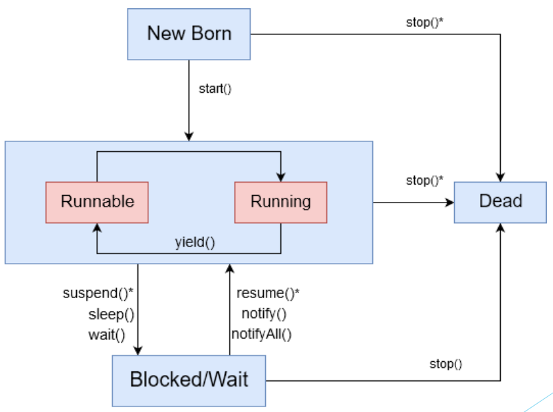

# Java Threads

## Threads
1. A multithreaded program contains two or more parts that can run concurrently
2. Each part of such a program is called a thread, and each thread defines a separate path of
execution.
3. A thread is a single sequential flow of execution within a program.
i.e. a thread is a subset of process.
4. Thread is considered as “Light Weight Process” because it use less resource than process.
5. Threads share the address space of the process but process have their own address space.
6. JVM create the thread whose task is to define the main thread.
7. Threads may be executed either on a multi-processor machine, or (more common) in
simulated parallel on a single-processor machine on a time-sharing basis.

## Multithreading
1. Multithreading in java is a process of executing multiple threads simultaneously.
2. Thread is basically a lightweight sub-process, a smallest unit of processing.
Multiprocessing and multithreading, both are used to achieve multitasking.
3. But we use multithreading than multiprocessing because threads share a common
memory area.
4. Threads don’t allocate separate memory area so saves memory,
and context-switching between the threads takes less time than process.
5. Java Multithreading is mostly used in games, animation etc.

## Thread Creation

Two ways to create thread: 

1. Extending Thread Class: 

```java 
private class HelloThread{

public class Main extends Thread{

    public void run(){
        System.out.println("Hello From Thread");
    }
    public static void main(String[] args) {
        Thread t = new Main();
        t.start();
    }
}
```
2. Implementing Runnable Interface:

```java 
public class Main implements Runnable{
    public void run(){
        System.out.println("Hello From Thread");
    }
    public static void main(String args[]){
        Thread t = new Thread(new Main());
        t.start();
    }
}
```

## Life Cycle of a Thread (Thread States)




## Examples
Creates ten threads to search for the maximum value of a large matrix. Each thread searches one portion of the matrix
```java 

import java.util.Random;

public class Main {
    final static int WIDTH = 100;
    final static int HEIGHT = 100;

    public static class WorkerThread extends Thread {
        int max = Integer.MIN_VALUE;
        int[] ourArray;

        public WorkerThread(int[] ourArray) {
            this.ourArray = ourArray;
        }

        public void run() {
            for (int i = 0; i < ourArray.length; i++)
                max = Math.max(max, ourArray[i]);
        }

        public int getMax() {
            return max;
        }
    }

    public static int[][] getBigHairyMatrix() {
        int[][] int_array = new int[WIDTH][HEIGHT];
        Random rand = new Random();

        for (int i = 0; i < HEIGHT; i++) {
            for (int j = 0; j < WIDTH; j++) {
                int_array[i][j] = rand.nextInt();
            }
        }
        return int_array;
    }

    public static void main(String args[]) {
        WorkerThread[] threads = new WorkerThread[10];
        int[][] bigMatrix = getBigHairyMatrix();
        int max = Integer.MIN_VALUE;

        for (int i = 0; i < 10; i++) {
            threads[i] = new WorkerThread(bigMatrix[i]);
            threads[i].start();
        }

        try {
            for (int i = 0; i < 10; i++) {
                threads[i].join();
                max = Math.max(max, threads[i].getMax());
            }
        } catch (InterruptedException e) {
            e.printStackTrace();
        }

        System.out.println("Maximum value was " + max);
    }
}

```

Same but by implementing Runnable Interface:

```java 

import java.util.Random;

public class Main {
    final static int WIDTH = 100;
    final static int HEIGHT = 100;

    public static class WorkerThread implements Runnable {
        int max = Integer.MIN_VALUE;
        int[] ourArray;

        public WorkerThread(int[] ourArray) {
            this.ourArray = ourArray;
        }

        public void run() {
            for (int i = 0; i < ourArray.length; i++)
                max = Math.max(max, ourArray[i]);
        }

        public int getMax() {
            return max;
        }
    }

    public static int[][] getBigHairyMatrix() {
        int[][] int_array = new int[WIDTH][HEIGHT];
        Random rand = new Random();

        for (int i = 0; i < HEIGHT; i++) {
            for (int j = 0; j < WIDTH; j++) {
                int_array[i][j] = rand.nextInt();
            }
        }
        return int_array;
    }

    public static void main(String args[]) {
        Thread[] threads = new Thread[10];
        int[][] bigMatrix = getBigHairyMatrix();
        int max = Integer.MIN_VALUE;

        for (int i = 0; i < 10; i++) {
            threads[i] = new Thread(new WorkerThread(bigMatrix[i]));
            threads[i].start();
        }

        try {
            for (int i = 0; i < 10; i++) {
                threads[i].join();
                max = Math.max(max, ((WorkerThread) threads[i].getRunnable()).getMax());
            }
        } catch (InterruptedException e) {
            e.printStackTrace();
        }

        System.out.println("Maximum value was " + max);
    }
}
```
Write a multithreaded JAVA application to multiply two 100 x 100 matrix, Like the previous example, again use 10 threads, Assign 10 rows to each thread, Fill your matrix with random values, Remember you are practicing the idea that, the main thread should wait for the other 10 threads to complete, so that it can form the final result

